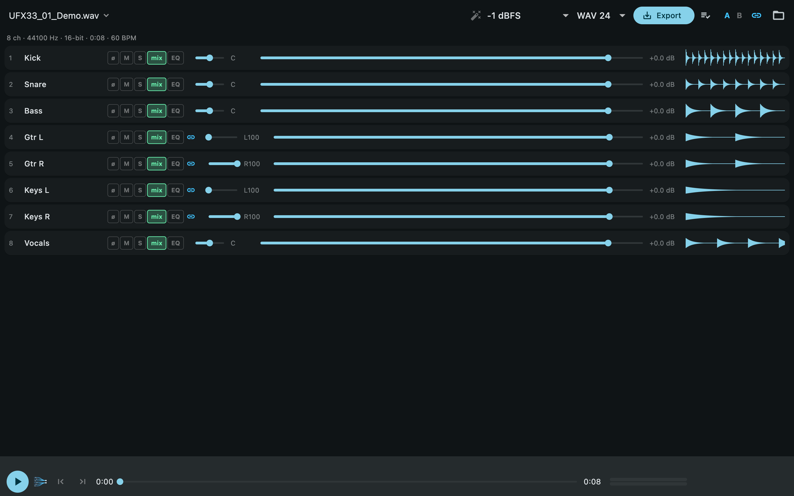
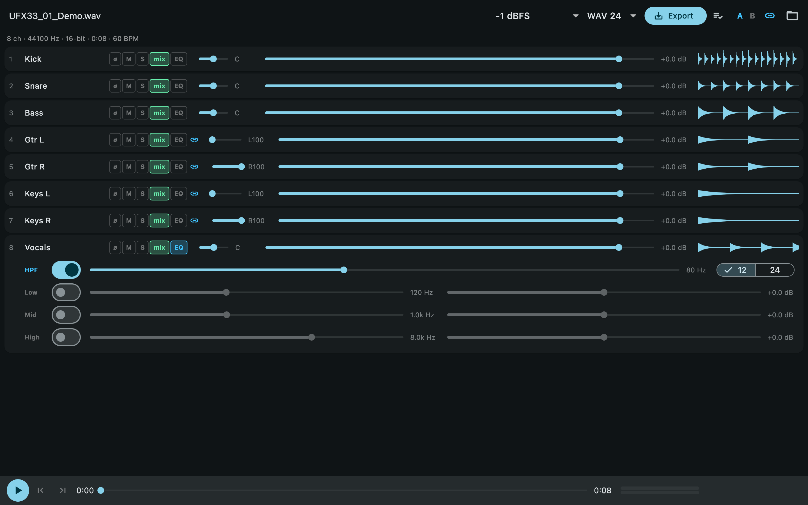
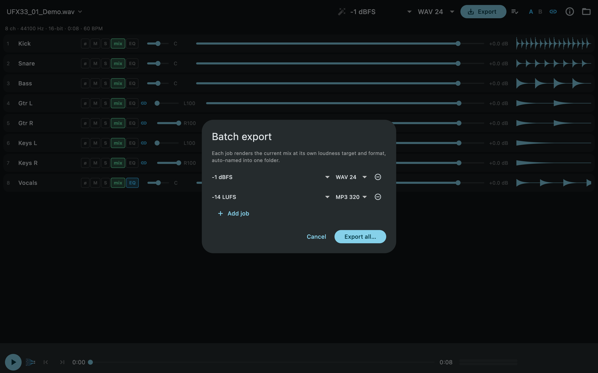
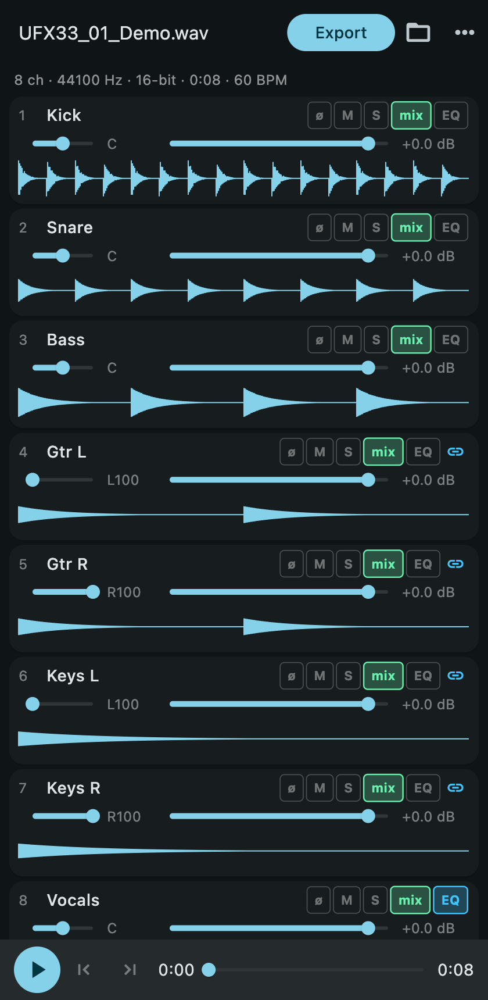

<p align="center">
  
</p>

# DurecMix

Cross-platform, fully offline downmixer for multichannel WAV recordings from the **RME DUREC** recorder — the successor of [MultiChannelWavMixer](https://github.com/MacBuchi/MultiChannelWavMixer), rebuilt with a Flutter UI and a Rust DSP engine.

**Targets:** macOS · Windows · Android · iOS

---

## Why a rewrite?

The original Python/customtkinter tool ran on desktop only, loaded entire recordings into RAM, and took a few audio-engineering shortcuts. DurecMix keeps its workflow (load DUREC WAV → adjust per-track faders → export a stereo mix) and fixes the foundations:

| | MultiChannelWavMixer (Python) | DurecMix |
|---|---|---|
| Platforms | macOS, Windows | macOS, Windows, Android, iOS |
| Pan law | linear (−6 dB centre error) | **constant-power (−3 dB centre)** |
| Peak handling | sample peak | **true-peak limiter (8× oversampled, −1 dBTP)** |
| Phase | destructive auto-"fix" | **per-track polarity switch** |
| Memory | whole file in RAM | **streamed blocks — multi-GB files on phones** |
| >4 GB recordings | unsupported | **RF64/BW64 support** |
| Solo / mute | – | ✔ |
| Loudness targets | −12 LUFS only | **−14/−16/−23/custom LUFS (EBU R128)** |
| EQ | – | **per-track HPF (12/24 dB/oct) + 3-band EQ** |
| Formats | 16-bit WAV, MP3 | **WAV 16/24/32f, FLAC 16/24, MP3 320** |
| USB-stick import on Android | – | **SAF fd handoff — no copying** |

## Screenshots



| Per-track HPF + 3-band EQ | Batch export queue |
|---|---|
|  |  |



Screenshots are rendered reproducibly from a synthetic fixture:
`flutter test integration_test -d macos --dart-define=SCREENSHOTS=true`
(prints `SCREENSHOT_DIR=…`; copy the PNGs into `docs/screenshots/`).

## Architecture

```
engine/          Pure Rust DSP + file I/O (no FFI, no GUI) — fully unit-tested
rust/            flutter_rust_bridge API layer (thin DTO conversion only)
lib/             Flutter app (UI, state, platform file access)
rust_builder/    cargokit glue that builds the Rust crate inside flutter build
```

- `engine/` must stay free of FFI and UI concerns; all audio logic and tests live here.
- `rust/` must stay logic-free; it only converts bridge DTOs ↔ engine types.
- Audio is never fully loaded: the engine streams 64 Ki-frame blocks and renders in two passes (analysis → render).

## Features (v0.6)

- **Streaming engine** — WAV/RF64/BW64 (16/24/32-bit PCM, 32/64-float), iXML track names, 64 Ki-frame blocks, two-pass render; multi-GB takes never load into RAM
- **Mixing** — gain (−60…+6 dB), constant-power pan, polarity ø, solo/mute/in-mix, stereo-pair linking (`· L`/`· R`) with per-pair unlink, monitor feeds auto-excluded on fresh sessions, A/B mix snapshots
- **Per-track DSP** — HPF (12/24 dB/oct Butterworth) + low shelf / mid peak / high shelf, click-free live tweaking, identical in preview and export
- **Master** — true-peak lookahead limiter (8× oversampled detection, −1 dBTP), loudness targets −14/−16/−23/custom LUFS or peak −1 dBFS, TPDF dither on 16-bit
- **Live preview** — cpal playback (~0.2 s latency), peak / LUFS-M / LUFS-I / true-peak / correlation meters, per-channel waveforms
- **Export** — WAV 16/24/32f, FLAC 16/24 (streamed), MP3 320 (LAME); trim in/out with 80 ms fades; loudness report (LUFS-I · dBTP · LRA · gain); BPM detection; filenames like `Take_16LUFS_143BPM_20260712_183000.flac`; batch queue renders several targets/formats into one folder (desktop)
- **Sessions** — every mix auto-saves to the app container and restores on reopen
- **Android** — Storage Access Framework: recordings open via file descriptors, zero copying; exports keep running in the background behind a progress notification
- **iOS** — Files-app import in place (security-scoped, zero copying); exports land wherever Files can reach (iCloud, USB drive)
- **Phone UI** — compact app bar and transport on narrow screens

Binaries for macOS, Windows and Android are attached to each [GitHub Release](../../releases).

### Roadmap

- On-device verification of Android/iOS file access (desktop is fully tested; phone builds are CI-verified only)
- Signed store releases (needs an Apple Developer account)
- Batch export on phones (SAF directory tree / Files folder access)

## Development

Prerequisites: [Flutter](https://docs.flutter.dev/get-started/install) (stable) and [Rust](https://rustup.rs) (stable).

```sh
flutter pub get
cargo test --workspace                    # 55 engine tests
cargo clippy --workspace --all-targets -- -D warnings
flutter analyze
flutter test integration_test -d macos    # real app + engine, headless-driven
flutter run -d macos                      # or: windows, an Android/iOS device
```

Useful engine CLIs (`--release` recommended):

```sh
cargo run -p durecmix-engine --release --example render_demo  <in.wav> <out.wav> [lufs]
cargo run -p durecmix-engine --release --example analyze_demo <in.wav>   # BPM etc.
cargo run -p durecmix-engine --release --example play_demo    <in.wav> [start_s]
cargo run -p durecmix-engine --example gen_fixture [out.wav]  # synthetic test WAV
```

Rust bindings are generated — after changing `rust/src/api/`, run:

```sh
flutter_rust_bridge_codegen generate
```

## Workflow

[Conventional Commits](https://www.conventionalcommits.org/); feature branches with squash-merged PRs, merged only on a green CI matrix (macOS/Windows/Android/iOS). Releases are tag-driven: bump `pubspec.yaml`, push `vX.Y.Z`, and `release.yml` attaches macOS/Windows/Android artifacts to a GitHub Release. Details in `AGENTS.md` and `docs/PLAN.md`.
