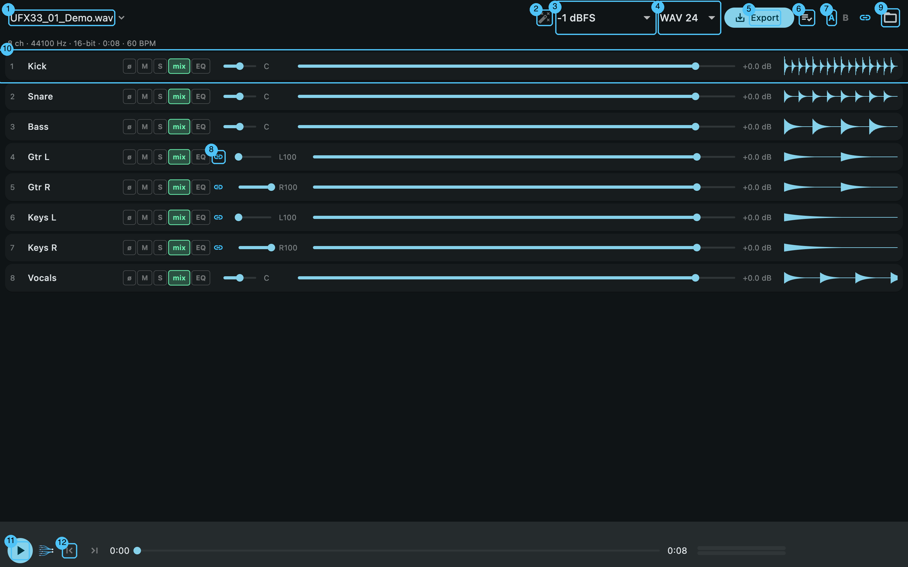
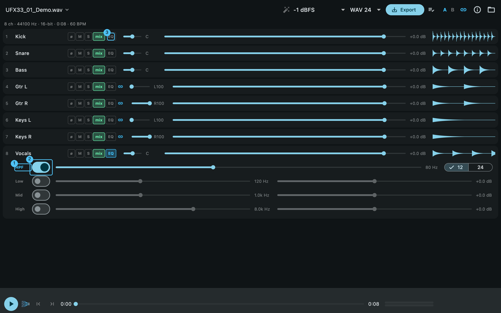
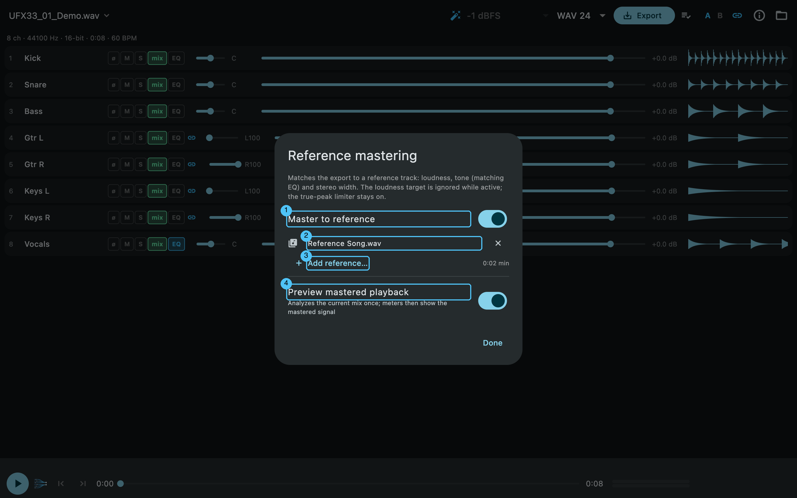
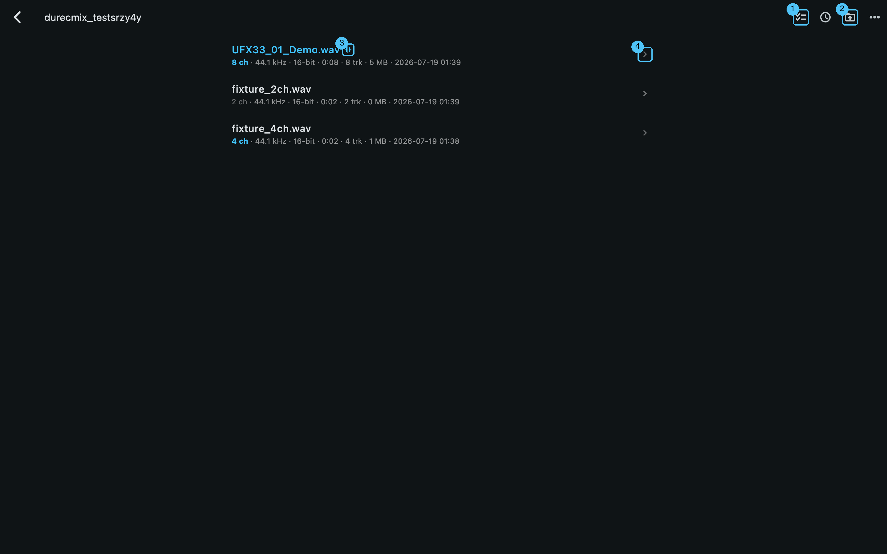
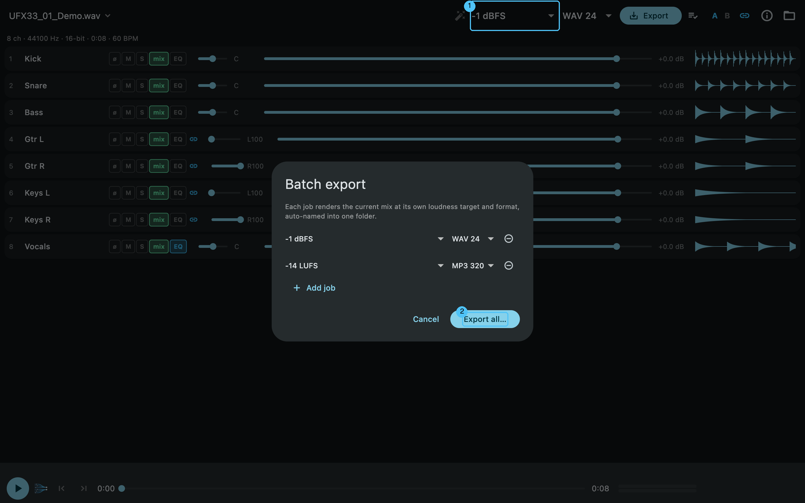
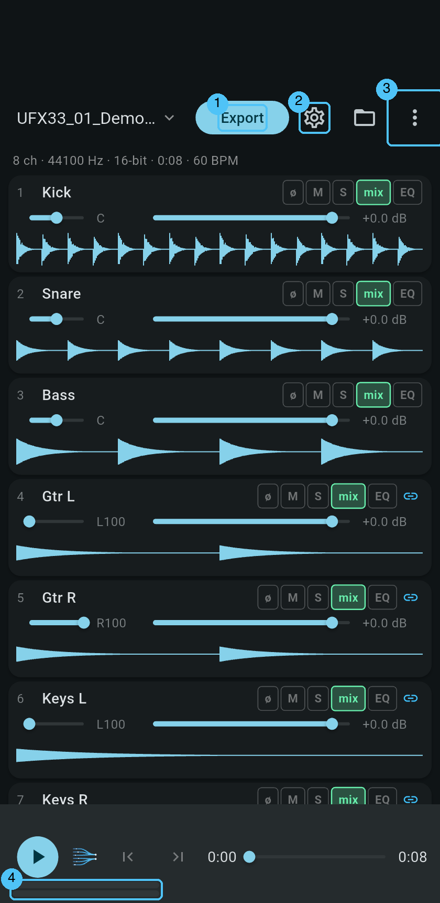
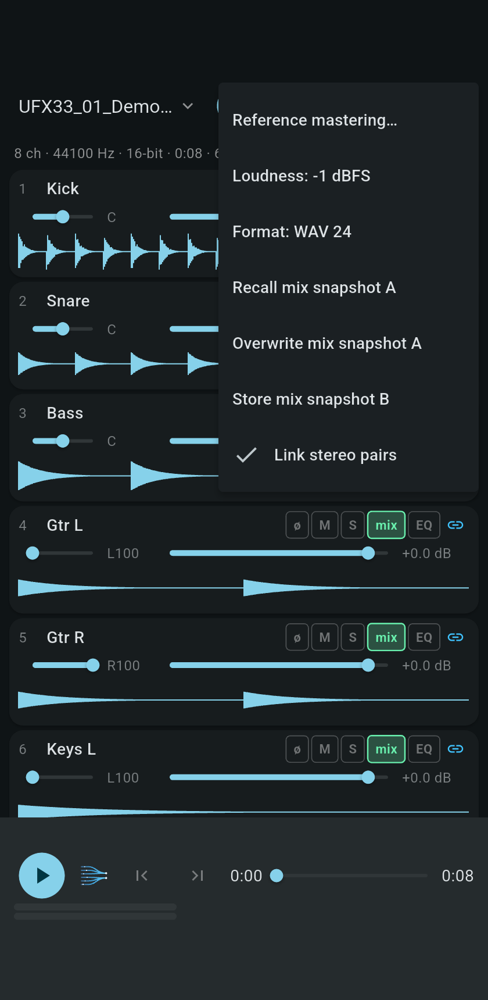

<p align="center">
  
</p>

# DurecMix

Cross-platform, fully offline downmixer for multichannel WAV recordings from the **RME DUREC** recorder — the successor of [MultiChannelWavMixer](https://github.com/MacBuchi/MultiChannelWavMixer), rebuilt with a Flutter UI and a Rust DSP engine.

**Targets:** macOS · Windows · Android · iOS
**Docs:** the **[User Guide](docs/GUIDE.md)** walks through every screen with annotated screenshots.

---

## What it does

Open a DUREC take straight off the USB stick, balance the tracks (fader, pan, polarity, solo/mute, per-track EQ), listen to a live preview with real loudness meters — then export a stereo mixdown with an EBU R128 loudness target and a true-peak limiter. Or let **reference mastering** match your mix to how your favourite songs sound. Multi-GB recordings stream in blocks and never load into RAM, so all of it works on a phone too.

## Screenshots

*Desktop (macOS) — the numbers are explained in the [User Guide](docs/GUIDE.md):*



| Per-track HPF + 3-band EQ | Reference mastering |
|---|---|
|  |  |

| WAV browser | Batch export queue |
|---|---|
|  |  |

*Android (same app, phone layout):*

<p>
  
  
</p>

Screenshots are rendered reproducibly from a synthetic fixture through the real engine, with the callouts drawn from live widget coordinates: `tool/make_screenshots.sh` (desktop) and `tool/make_screenshots.sh -d <emulator>` (Android).

## Features (v0.12)

- **Streaming engine** — WAV/RF64/BW64 (16/24/32-bit PCM, 32/64-float), iXML track names, 64 Ki-frame blocks, two-pass render; multi-GB takes never load into RAM
- **WAV browser** — pick a folder once (USB stick via SAF on Android), see every take with channels · rate · bits · duration · iXML count; tap the app-bar title to switch takes
- **Mixing** — gain (−60…+6 dB), constant-power pan, polarity ø, solo/mute/in-mix, stereo-pair linking (`·L`/`·R`) with per-pair unlink, monitor feeds auto-excluded on fresh sessions, A/B mix snapshots
- **Per-track DSP** — HPF (12/24 dB/oct Butterworth) + low shelf / mid peak / high shelf, click-free live tweaking, identical in preview and export
- **Reference mastering** — match loudness, tonal balance (matching EQ) and stereo width to reference songs (WAV/FLAC/MP3/OGG); several references average into a genre target curve; audible in the live preview on demand. Clean-room Matchering-style algorithm, validated against Matchering 2.0 (−23.5 dB null-test depth)
- **Master** — true-peak lookahead limiter (8× oversampled detection, −1 dBTP), loudness targets −14/−16/−23/custom LUFS or peak −1 dBFS, TPDF dither on 16-bit
- **Live preview** — cpal playback (~0.2 s latency), peak / LUFS-M / LUFS-I / true-peak / correlation meters, per-channel waveforms, height-stable transport bar with tap-for-details export report
- **Export** — WAV 16/24/32f, FLAC 16/24 (streamed), MP3 320 (LAME); trim in/out with 80 ms fades; loudness report (LUFS-I · dBTP · LRA · gain/mastering match); BPM detection; auto-naming like `Take_16LUFS_143BPM_20260712_183000.flac`
- **Batch & multi-file export** — several loudness/format targets of one take in one go (desktop), or the current mix applied to many ticked takes into a `Mixdown/` folder with per-row progress and an Android share sheet
- **Feedback & updates** — an in-app banner files a feature request or bug straight to GitHub as a pre-filled, labelled issue (browser-form fallback when no token is baked in); an update banner offers the newer release (in-app APK install on Android, release page on desktop)
- **Sessions** — every mix auto-saves to the app container and restores on reopen; caches make take-switching and repeated reference use instant
- **Android** — Storage Access Framework: recordings open via file descriptors, zero copying; exports keep running in the background behind a progress notification; stable APK signature since v0.7.2 (in-place updates)
- **iOS** — Files-app import in place (security-scoped, zero copying); exports land wherever Files can reach

Binaries for macOS, Windows and Android are attached to each [GitHub Release](../../releases).

### Why a rewrite?

The original Python tool ran on desktop only, loaded entire recordings into RAM, and took a few audio-engineering shortcuts:

| | MultiChannelWavMixer (Python) | DurecMix |
|---|---|---|
| Platforms | macOS, Windows | macOS, Windows, Android, iOS |
| Pan law | linear (−6 dB centre error) | **constant-power (−3 dB centre)** |
| Peak handling | sample peak | **true-peak limiter (8× oversampled)** |
| Phase | destructive auto-"fix" | **per-track polarity switch** |
| Memory | whole file in RAM | **streamed blocks — multi-GB on phones** |
| >4 GB recordings | unsupported | **RF64/BW64 support** |
| Loudness targets | −12 LUFS only | **−14/−16/−23/custom LUFS (EBU R128)** |
| EQ / mastering | – | **per-track EQ + reference mastering** |
| Formats | 16-bit WAV, MP3 | **WAV 16/24/32f, FLAC 16/24, MP3 320** |
| USB-stick import on Android | – | **SAF fd handoff — no copying** |

### Roadmap

- iOS on-device verification (macOS/Windows/Android are device-tested)
- Signed store releases (needs an Apple Developer account)

## Development

Prerequisites: [Flutter](https://docs.flutter.dev/get-started/install) (stable) and [Rust](https://rustup.rs) (stable).

```sh
flutter pub get
cargo test --workspace                    # engine tests
cargo clippy --workspace --all-targets -- -D warnings
flutter analyze
flutter test integration_test -d macos    # real app + engine, headless-driven
flutter run -d macos                      # or: windows, an Android/iOS device
```

Useful engine CLIs (`--release` recommended):

```sh
cargo run -p durecmix-engine --release --example render_demo  <in.wav> <out.wav> [lufs]
cargo run -p durecmix-engine --release --example master_demo  <in.wav> <reference> <out.wav> [--no-limiter]
cargo run -p durecmix-engine --release --example analyze_demo <in.wav>   # BPM etc.
cargo run -p durecmix-engine --release --example play_demo    <in.wav> [start_s]
cargo run -p durecmix-engine --example gen_fixture [out.wav]  # synthetic test WAV
```

Rust bindings are generated — after changing `rust/src/api/`, run `flutter_rust_bridge_codegen generate`.

Architecture:

```text
engine/          Pure Rust DSP + file I/O (no FFI, no GUI) — fully unit-tested
rust/            flutter_rust_bridge API layer (thin DTO conversion only)
lib/             Flutter app (UI, state, platform file access)
rust_builder/    cargokit glue that builds the Rust crate inside flutter build
```

## Acknowledgements & licenses

DurecMix itself is licensed under the [MIT License](LICENSE).

**Reference mastering** is an independent **clean-room** implementation
inspired by [Matchering 2.0](https://github.com/sergree/matchering) by Sergey
Grishakov (GPL-3.0). It was written from the *publicly documented algorithm
description only* and contains **no Matchering source code** — so it is not a
derivative work and carries no GPL obligation. The specifics are our own and
differ from Matchering: log-frequency moving-average smoothing (not LOWESS),
an analytic Parseval-based level correction (not the iterative RMS loop), a
true-peak limiter (not Hyrax), and a linear-phase FIR matching-EQ. It was
validated against Matchering 2.0 with a −23.5 dB null-test depth. Credit and
thanks to the Matchering project for the original idea.

Bundled third-party components keep their own licenses: [Symphonia](https://github.com/pdeljanov/Symphonia)
(MPL-2.0) and LAME via [mp3lame-encoder](https://crates.io/crates/mp3lame-encoder)
(LGPL-2.1) are used unmodified; realfft/rustfft, ebur128, flacenc, hound, cpal
and flutter_rust_bridge are MIT/Apache-2.0.

## Workflow

[Conventional Commits](https://www.conventionalcommits.org/); feature branches with squash-merged PRs, merged only on a green CI matrix (macOS/Windows/Android/iOS). Releases are automatic: the last PR of a shipping chain bumps `pubspec.yaml`, and a merge to `main` with an untagged version tags and publishes itself (a CI housekeeping check catches forgotten bumps). Details in `AGENTS.md` and `docs/PLAN.md`.
