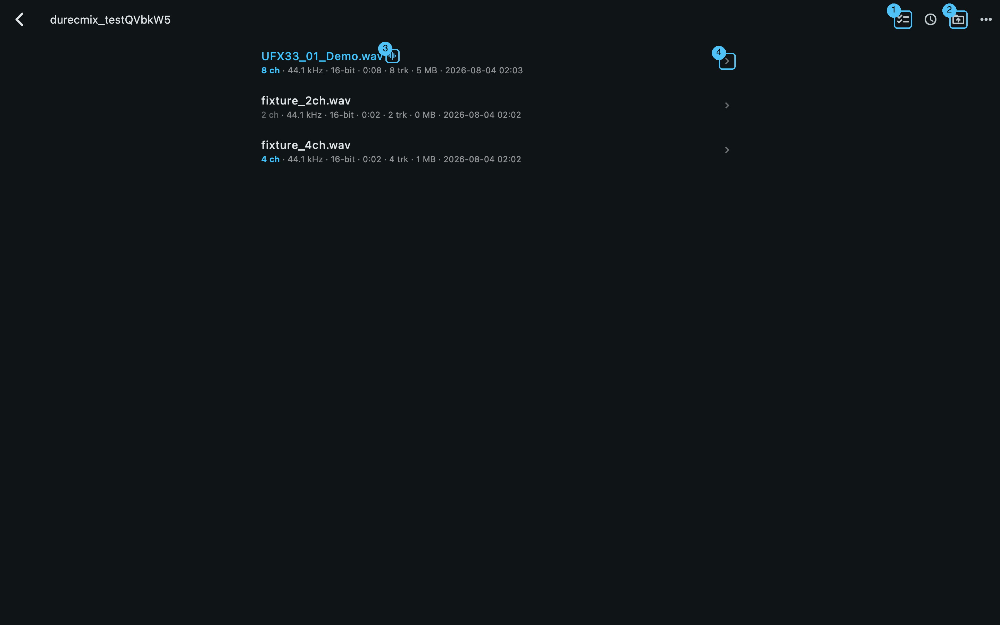
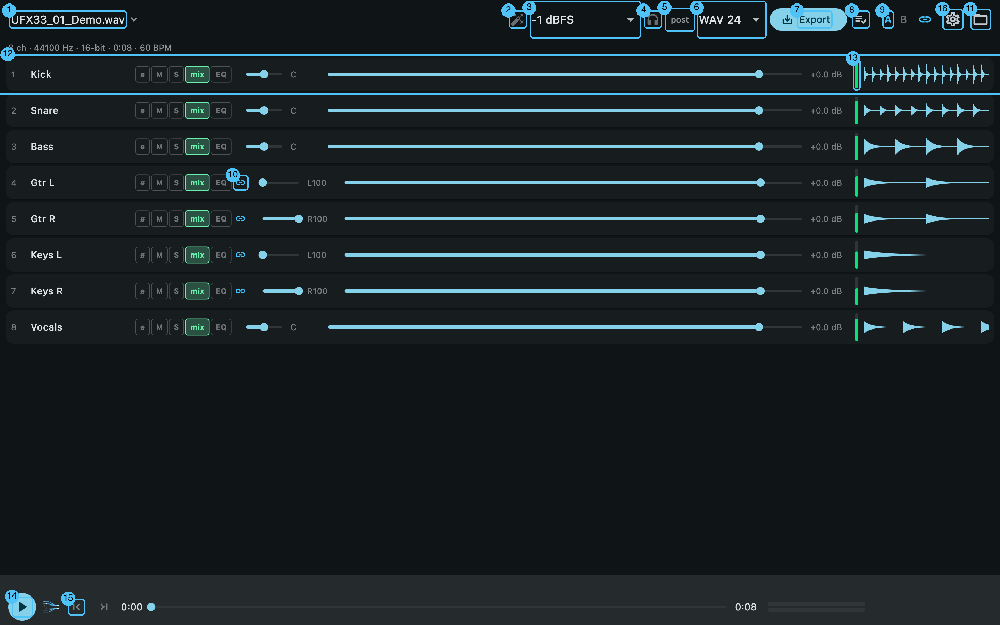
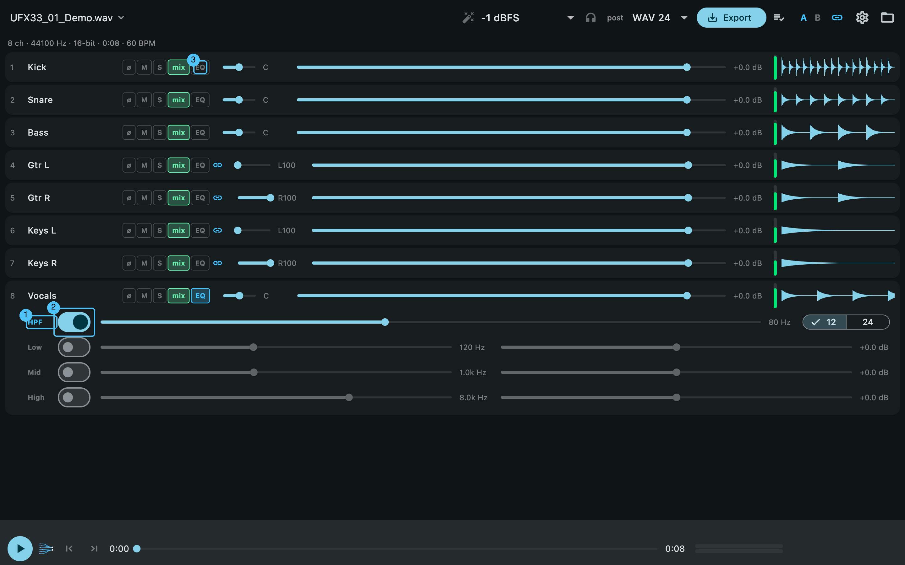
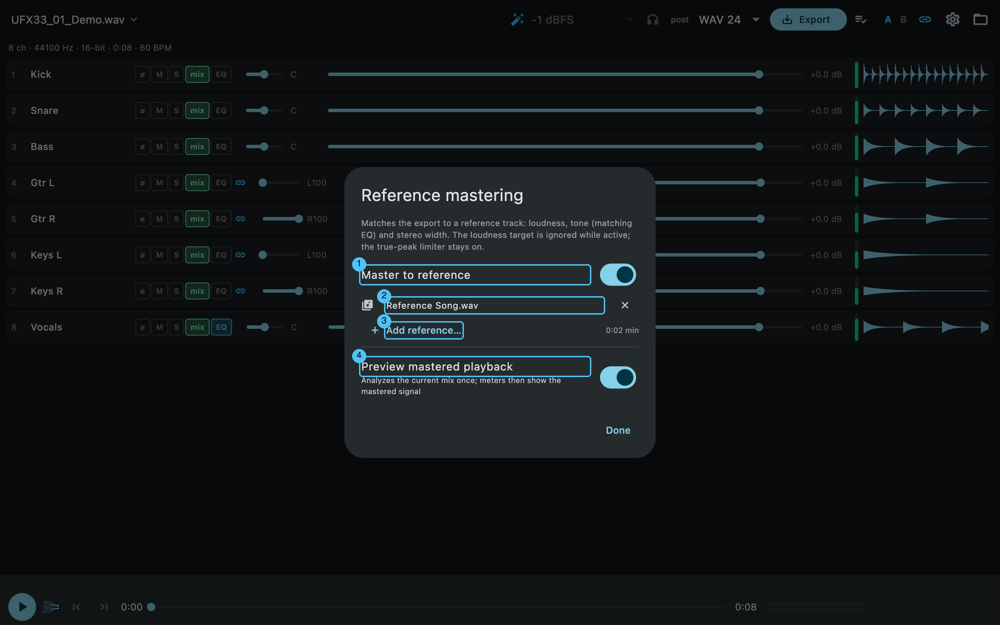
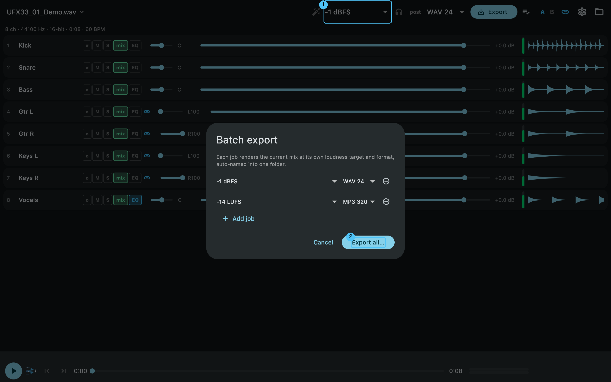
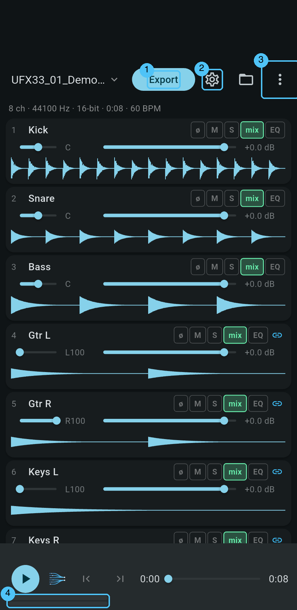
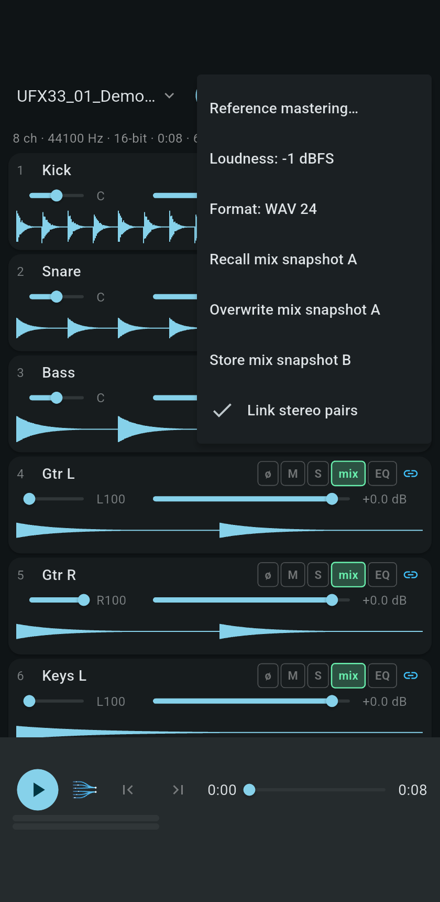

# DurecMix — User Guide

DurecMix turns a multichannel **RME DUREC** recording (WAV/RF64/BW64 from a
USB stick) into a finished stereo mix — on macOS, Windows, Android and iOS,
fully offline. This guide walks through every screen; the numbered badges in
the screenshots match the lists below them.

All screenshots are generated from the app itself and can be refreshed any
time with `tool/make_screenshots.sh` (see [Development](#regenerating-the-screenshots)).

---

## 1. Opening a recording — the WAV browser

On first launch, pick your recordings folder (the DUREC USB stick or a copy
of it). DurecMix lists the WAV files with their metadata and remembers the
folder.



1. **Selection mode** — tick several takes for a [multi-file export](#8-exporting).
2. **Sort** by name or recording date.
3. **Switch to another folder.**
4. Marks the **currently loaded take**.
5. **Tap a row** to open that take in the mixer. The subtitle shows
   channels · sample rate · bit depth · duration · iXML track count, probed
   lazily in the background (fine on slow USB sticks).

Tips: the app-bar **title** in the mixer reopens this browser, so switching
between takes of a session is two taps. iOS currently uses the system file
picker instead of the in-app browser.

## 2. The mixer



1. **Loaded take** — tap to switch to another recording of the folder.
2. **Reference mastering** — match the export to reference songs
   ([section 7](#7-reference-mastering)). Blue = active, amber = the
   mastered preview is stale.
3. **Loudness target** — applied on export
   ([section 6](#6-loudness-targets--output-formats)).
4. **Preview at export level** — play the mix at the level the exported file
   will have ([section 4](#preview-at-export-level)).
5. **Track meters: pre or post** — switches every strip's level meter between
   what arrives on the track and what it contributes to the mix
   ([section 3](#3-track-strips--eq)).
6. **Output format** — WAV 16/24/32-float, FLAC 16/24, MP3 320.
7. **Export** the stereo mixdown ([section 8](#8-exporting)).
8. **Batch export** — render several loudness/format targets in one go
   (desktop).
9. **A/B mix snapshots** — tap an empty slot to store the current mix, tap a
   filled slot to recall it; long-press (or right-click) overwrites.
10. **Link stereo pairs** — tracks named `…·L`/`…·R` mirror gain, mute, solo
    and EQ, with inverted pans. The link chip on a paired strip unlinks just
    that pair; relinking copies the tapped side to its partner.
11. **Choose the recordings folder.**
12. **Track strip** — one per recorded channel ([section 3](#3-track-strips--eq)).
13. **Level meter** of that track — greyed out while the track is muted, taken
    out of the mix, or soloed away, so you can still see that signal is there.
14. **Play / stop** the live preview ([section 4](#4-playback--metering)).
15. **Trim-in / trim-out** at the playhead; long-press clears
    ([section 5](#5-trimming)).
16. **Settings** — appearance, storage, and the way into About: installed
    version, update status, project links and feedback
    ([section 11](#11-feedback--updates)).

A fresh session starts with **every** recorded track in the mix. Note that
DUREC also records the monitor and cue buses it was configured to record (in
ear, headphone and line-out feeds): those carry the same signal as the
sources, so leaving them in doubles instruments and pushes a unity mix far
above full scale. Take them out with the **mix** chip on their strip — which
channels those are depends on your interface configuration, so only you know
their names. The choice is saved per take.

## 3. Track strips & EQ

Each strip carries (left to right): track number and name, the toggle chips,
pan, fader, the level meter, and the waveform.

- **ø** — polarity invert (instead of any destructive auto-"phase fix").
- **M / S** — mute / solo.
- **mix** — whether the track is part of the mixdown at all (green = in).
- **EQ** — expands the per-track EQ panel:



1. **High-pass filter** with 12 or 24 dB/oct slope — rumble and stage bleed.
2. Each band has an **on/off switch** plus gain and frequency sliders:
   low shelf, mid peak, high shelf (RBJ biquads — identical in preview and
   export).
3. The **EQ chip** toggles the panel; it lights up while any band is active.

### The level meter

The thin bar next to each fader uses the same scale and colours as the master
meter, so "hot" means the same thing in both places. The **pre** / **post**
button in the header switches all of them at once:

- **post** (the default) shows what the track *contributes to the mix* — the
  question you are asking while mixing. Pull a fader down and its bar follows.
- **pre** shows what *arrives* on the track, whatever its fader does. This is
  the one for finding a channel that is silent, overloaded, or not what you
  expected it to be.

A muted track — or one taken out of the mix, or soloed away — keeps showing its
level, greyed out. That is deliberate: muting is exactly when you want to see
that there *is* something on the track. Because such a track is not being
processed at all, its greyed bar ignores its EQ.

The bars follow the track's EQ otherwise, and hold a peak briefly so a short
one is visible at all. They are only useful for spotting a silent or a hot
channel among thirty-odd — read actual levels off the master meter.

Every change is saved automatically (debounced) into a per-take session
file, so reopening a recording restores the exact mix.

## 4. Playback & metering

Play starts a live preview of the current mix — faders, pans, EQ and
solo/mute react instantly (~0.2 s). The transport bar keeps a constant
height; its meters show:

- **Peak L/R** bars,
- **LUFS-M / LUFS-I** — momentary and integrated loudness (EBU R128),
- **TP** — running true-peak maximum (dBTP),
- **corr** — stereo correlation.

By default the preview plays *pre-normalisation*: LUFS-I predicts what the
export's first pass will measure. With the [mastered
preview](#7-reference-mastering) enabled, the meters show the mastered signal
instead.

### Preview at export level

The headphones button next to the loudness target switches the preview to the
level the exported file will have. This matters more than it sounds: a DUREC
take whose unity mix sits around +16 dBFS is turned down by roughly 17 dB on
export, so without this the limiter works flat out during preview and the
preview does not sound like the result.

Switching it on measures the mix once (progress runs in the button) — the
gain the export would apply needs a look at the whole file. From then on the
meters show the *delivered* signal rather than the raw mix, which is the
point: what you hear is what you get.

Change the mix afterwards and the button turns **amber**: the measurement
belongs to a mix that no longer exists. The gain keeps playing unchanged —
one that jumped on every fader move would be worse — and a tap measures
again. While reference mastering is on the button is disabled, because the
reference owns the level there.

After an export, the status line above the transport summarises the result —
hover for the full text (desktop) or **tap it** for a detail dialog with all
values and the output path.

## 5. Trimming

The trim buttons (mixer badge 15) set trim-in/trim-out at the current
playhead; long-press clears a point. Exports render only the trimmed range
and apply 80 ms fades at trim boundaries. Trim and fades are per-take and
deliberately **not** carried into batch or multi-file exports.

## 6. Loudness targets & output formats

The loudness dropdown selects the export normalisation:

| Choice | Meaning |
|---|---|
| none | No gain change (static clip protection if the limiter is off) |
| −1 dBFS | Peak-normalise the sample peak to −1 dBFS |
| −14 / −16 / −23 LUFS | Integrated-loudness targets (streaming / R128) |
| custom LUFS | Any value, −30…−6 |

A true-peak limiter (8× oversampled detection, −1 dBTP ceiling) guards every
export; 16-bit targets get TPDF dither. While reference mastering is active
the loudness dropdown is greyed out — the reference owns the level.

## 7. Reference mastering

Match your mix to how finished songs sound — loudness, tonal balance
(matching EQ) and stereo width. A clean-room implementation of the
Matchering idea, validated against Matchering 2.0 (−23.5 dB null-test depth).



1. **Master to reference** — the main switch. While on, exports are matched
   to the reference set and the loudness target is bypassed (the true-peak
   limiter stays active as the safety net).
2. The **chosen references**. One song imposes its own character; several
   stylistically matching songs average into a genre target curve — one
   vote per song. Remove entries with ✕.
3. **Add reference** — any WAV/FLAC/MP3/OGG. Each file is analyzed once
   (spectrum fingerprint, cached), so re-using a reference is instant.
4. **Preview mastered playback** — analyzes the current mix once (progress
   bar) and inserts the mastering stage into the live preview. After mix
   changes the preview keeps playing the frozen plan and the wand icon turns
   **amber**; hit *Refresh* in this dialog to re-analyze. Nothing re-scans
   your multi-GB file behind your back.

The export report then reads `matched to <reference> (±x dB)`. Mastering
works in single, batch and multi-file exports alike.

## 8. Exporting

- **Export** (mixer badge 7) renders the current take: two streamed passes,
  so multi-GB recordings never load into RAM — phones included. A report
  (LUFS-I, dBTP, LRA, gain or mastering match) appears above the transport.
- **Batch export** (badge 8, desktop): queue several loudness/format
  combinations of the *current* take and render them into one folder,
  auto-named like `Take_-14LUFS_120BPM_2026-07-19.wav`.



- **Multi-file export** (browser selection mode): tick several takes and
  export them all with the *current* mix applied by track name (index
  fallback). Outputs land in a `Mixdown/` subfolder; every row shows its own
  progress, and Android offers the system share sheet afterwards. Sessions
  of the other takes are never modified.

## 9. On the phone

<p>
  
  
</p>

1. **Export** stays visible (the button shows render progress); a
   notification keeps reporting while the app is in the background.
2. Everything else — mastering, loudness, format, snapshots, pair linking —
   moves into the **overflow menu**.
3. The meters live on their own row and idle while stopped.

Android reads recordings straight off the USB stick through Storage Access
Framework file descriptors — the multi-GB file is never copied. Grant the
folder once; the app keeps the permission. Exports can be shared from the
result snackbar. iOS opens files in place via the system picker.

## 10. In the browser

DurecMix also runs as a web page — nothing to install, and on a tablet too.
Open the recording, mix, listen, master and export exactly as in the app; the
same audio engine does the work, and the exported file is bit-for-bit the one
the installed app would have written.

Four things work differently, all because of what a browser is allowed to do:

- **The recording has to be chosen again after a reload.** A browser may not
  hold on to a file you picked, so there is no way to keep it across a visit.
  Your *mix* does survive — pick the same recording again and it is exactly
  where you left it, because mixes are stored under the file's name.
- **There is no folder to export into.** Each finished mixdown arrives as its
  own download instead. With several takes that means several downloads; on
  iPhone and iPad, Safari asks once per file.
- **MP3 export is app-only.** Use FLAC in the browser — it is lossless and
  plays everywhere.
- **A private window stores nothing at all.** Then a reload really does lose
  the mix. Settings says which of the two you are getting, under **Storage**.

Everything else — the WAV browser, EQ, reference mastering, the mastered
preview, trimming, batch and multi-file export — behaves as described above.

## 11. Feedback & updates

Two slim banners can appear above the mixer (each dismissible with ✕ for the
session):

- **💡 Request a feature or report a bug** — opens a short dialog (Feature or
  Bug, plus a text field). Submitting files a GitHub issue directly in the
  [project repo](https://github.com/MacBuchi/durec-multichannel-mixdown/issues),
  pre-tagged and pre-filled with your app version and platform. On builds
  without the issue token it opens the pre-filled issue form in your browser
  instead — same result, one extra click.
- **🔄 Update to vX.Y.Z available** — appears when a newer release exists.
  On Android it downloads and installs the APK in-app (with a progress bar);
  on desktop it opens the release page. The check is best-effort and silent
  on failure — it never interrupts your work.

The **ⓘ About** button in the app bar always shows your installed version and
whether you're up to date, with links to the GitHub project and this guide,
plus the same feedback shortcut. **What's new** opens the version history —
every release and what it changed, straight from the project's changelog.

## 12. Where things live

| Data | Location |
|---|---|
| Mix sessions (`<take>_<hash>.durecmix.json`) | app container, `Application Support/sessions/` |
| Waveform/BPM analysis cache | app container, `analysis/` |
| Reference profiles (mastering) | app container, `reference_profiles/` |
| Exports | wherever you save them; multi-file exports in `Mixdown/` next to the takes |

In the browser there is no app container: the same four kinds of data live in
the browser's own storage for that page, and exports become downloads.

Sessions are keyed by file identity, so they survive renaming the folder or
re-plugging the stick. Nothing ever writes next to your recordings except
the explicit `Mixdown/` output folder.

---

## Regenerating the screenshots

```sh
tool/make_screenshots.sh                 # desktop set (annotated)
tool/make_screenshots.sh -d emulator-…   # phone set from an Android emulator
```

The integration test renders every screen from a synthetic 8-track fixture
through the real engine and dumps marker coordinates from the live widget
tree; `tool/annotate_screenshots.py` draws the numbered callouts. The marker
labels double as the legends above — if the UI changes, rerun the script and
update the lists.
